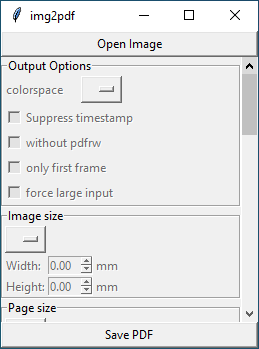

img2pdf
=======

Lossless conversion of raster images to PDF. You should use img2pdf if your
priorities are (in this order):

 1. **always lossless**: the image embedded in the PDF will always have the
    exact same color information for every pixel as the input
 2. **small**: if possible, the difference in filesize between the input image
    and the output PDF will only be the overhead of the PDF container itself
 3. **fast**: if possible, the input image is just pasted into the PDF document
    as-is without any CPU hungry re-encoding of the pixel data

Conventional conversion software (like ImageMagick) would either:

 1. not be lossless because lossy re-encoding to JPEG
 2. not be small because using wasteful flate encoding of raw pixel data
 3. not be fast because input data gets re-encoded

Another advantage of not having to re-encode the input (in most common
situations) is, that img2pdf is able to handle much larger input than other
software, because the raw pixel data never has to be loaded into memory.

The following table shows how img2pdf handles different input depending on the
input file format and image color space.

| Format                                | Colorspace                     | Result        |
| ------------------------------------- | ------------------------------ | ------------- |
| JPEG                                  | any                            | direct        |
| JPEG2000                              | any                            | direct        |
| PNG (non-interlaced, no transparency) | any                            | direct        |
| TIFF (CCITT Group 4)                  | monochrome                     | direct        |
| any                                   | any except CMYK and monochrome | PNG Paeth     |
| any                                   | monochrome                     | CCITT Group 4 |
| any                                   | CMYK                           | flate         |

For JPEG, JPEG2000, non-interlaced PNG and TIFF images with CCITT Group 4
encoded data, img2pdf directly embeds the image data into the PDF without
re-encoding it. It thus treats the PDF format merely as a container format for
the image data. In these cases, img2pdf only increases the filesize by the size
of the PDF container (typically around 500 to 700 bytes). Since data is only
copied and not re-encoded, img2pdf is also typically faster than other
solutions for these input formats.

For all other input types, img2pdf first has to transform the pixel data to
make it compatible with PDF. In most cases, the PNG Paeth filter is applied to
the pixel data. For monochrome input, CCITT Group 4 is used instead. Only for
CMYK input no filter is applied before finally applying flate compression.

Usage
-----

The images must be provided as files because img2pdf needs to seek in the file
descriptor.

If no output file is specified with the `-o`/`--output` option, output will be
done to stdout. A typical invocation is:

	$ img2pdf img1.png img2.jpg -o out.pdf

The detailed documentation can be accessed by running:

	$ img2pdf --help

Bugs
----

 - If you find a JPEG, JPEG2000, PNG or CCITT Group 4 encoded TIFF file that,
   when embedded into the PDF cannot be read by the Adobe Acrobat Reader,
   please contact me.

 - An error is produced if the input image is broken. This commonly happens if
   the input image has an invalid EXIF Orientation value of zero. Even though
   only nine different values from 1 to 9 are permitted, Anroid phones and
   Canon DSLR cameras produce JPEG images with the invalid value of zero.
   Either fix your input images with `exiftool` or similar software before
   passing the JPEG to `img2pdf` or run `img2pdf` with `--rotation=ifvalid`
   (if you run img2pdf from the commandline) or by passing
   `rotation=img2pdf.Rotation.ifvalid` as an argument to `convert()` when using
   img2pdf as a library.

 - img2pdf uses PIL (or Pillow) to obtain image meta data and to convert the
   input if necessary. To prevent decompression bomb denial of service attacks,
   Pillow limits the maximum number of pixels an input image is allowed to
   have. If you are sure that you know what you are doing, then you can disable
   this safeguard by passing the `--pillow-limit-break` option to img2pdf. This
   allows one to process even very large input images.

Installation
------------

On a Debian- and Ubuntu-based systems, img2pdf can be installed from the
official repositories:

	$ apt install img2pdf

If you want to install it using pip, you can run:

	$ pip3 install img2pdf

If you prefer to install from source code use:

	$ cd img2pdf/
	$ pip3 install .

To test the console script without installing the package on your system,
use virtualenv:

	$ cd img2pdf/
	$ virtualenv ve
	$ ve/bin/pip3 install .

You can then test the converter using:

	$ ve/bin/img2pdf -o test.pdf src/tests/test.jpg

If you don't want to setup Python on Windows, then head to the
[releases](/josch/img2pdf/releases) section and download the latest
`img2pdf.exe`.

GUI
---

There exists an experimental GUI with all settings currently disabled. You can
directly convert images to PDF but you cannot set any options via the GUI yet.
If you are interested in adding more features to the PDF, please submit a merge
request. The GUI is based on tkinter and works on Linux, Windows and MacOS.

Library
-------

The package can also be used as a library:

	import img2pdf

	# opening from filename
	with open("name.pdf","wb") as f:
		f.write(img2pdf.convert('test.jpg'))

	# opening from file handle
	with open("name.pdf","wb") as f1, open("test.jpg") as f2:
		f1.write(img2pdf.convert(f2))

	# opening using pathlib
	with open("name.pdf","wb") as f:
		f.write(img2pdf.convert(pathlib.Path('test.jpg')))

	# using in-memory image data
	with open("name.pdf","wb") as f:
		f.write(img2pdf.convert("\x89PNG...")

	# multiple inputs (variant 1)
	with open("name.pdf","wb") as f:
		f.write(img2pdf.convert("test1.jpg", "test2.png"))

	# multiple inputs (variant 2)
	with open("name.pdf","wb") as f:
		f.write(img2pdf.convert(["test1.jpg", "test2.png"]))

	# convert all files ending in .jpg inside a directory
	dirname = "/path/to/images"
	imgs = []
	for fname in os.listdir(dirname):
		if not fname.endswith(".jpg"):
			continue
		path = os.path.join(dirname, fname)
		if os.path.isdir(path):
			continue
		imgs.append(path)
	with open("name.pdf","wb") as f:
		f.write(img2pdf.convert(imgs))

	# convert all files ending in .jpg in a directory and its subdirectories
	dirname = "/path/to/images"
	imgs = []
	for r, _, f in os.walk(dirname):
		for fname in f:
			if not fname.endswith(".jpg"):
				continue
			imgs.append(os.path.join(r, fname))
	with open("name.pdf","wb") as f:
		f.write(img2pdf.convert(imgs))

	# convert all files matching a glob
	import glob
	with open("name.pdf","wb") as f:
		f.write(img2pdf.convert(glob.glob("/path/to/*.jpg")))

	# convert all files matching a glob using pathlib.Path
	from pathlib import Path
	with open("name.pdf","wb") as f:
		f.write(img2pdf.convert(*Path("/path").glob("**/*.jpg")))

	# ignore invalid rotation values in the input images
	with open("name.pdf","wb") as f:
		f.write(img2pdf.convert('test.jpg'), rotation=img2pdf.Rotation.ifvalid)

	# writing to file descriptor
	with open("name.pdf","wb") as f1, open("test.jpg") as f2:
		img2pdf.convert(f2, outputstream=f1)

	# specify paper size (A4)
	a4inpt = (img2pdf.mm_to_pt(210),img2pdf.mm_to_pt(297))
	layout_fun = img2pdf.get_layout_fun(a4inpt)
	with open("name.pdf","wb") as f:
		f.write(img2pdf.convert('test.jpg', layout_fun=layout_fun))

	# use a fixed dpi of 300 instead of reading it from the image
	dpix = dpiy = 300
	layout_fun = img2pdf.get_fixed_dpi_layout_fun((dpix, dpiy))
	with open("name.pdf","wb") as f:
		f.write(img2pdf.convert('test.jpg', layout_fun=layout_fun))

	# create a PDF/A-1b compliant document by passing an ICC profile
	with open("name.pdf","wb") as f:
		f.write(img2pdf.convert('test.jpg', pdfa="/usr/share/color/icc/sRGB.icc"))

Comparison to ImageMagick
-------------------------

Create a large test image:

	$ convert logo: -resize 8000x original.jpg

Convert it into PDF using ImageMagick and img2pdf:

	$ time img2pdf original.jpg -o img2pdf.pdf
	$ time convert original.jpg imagemagick.pdf

Notice how ImageMagick took an order of magnitude longer to do the conversion
than img2pdf. It also used twice the memory.

Now extract the image data from both PDF documents and compare it to the
original:

	$ pdfimages -all img2pdf.pdf tmp
	$ compare -metric AE original.jpg tmp-000.jpg null:
	0
	$ pdfimages -all imagemagick.pdf tmp
	$ compare -metric AE original.jpg tmp-000.jpg null:
	118716

To get lossless output with ImageMagick we can use Zip compression but that
unnecessarily increases the size of the output:

	$ convert original.jpg -compress Zip imagemagick.pdf
	$ pdfimages -all imagemagick.pdf tmp
	$ compare -metric AE original.jpg tmp-000.png null:
	0
	$ stat --format="%s %n" original.jpg img2pdf.pdf imagemagick.pdf
	1535837 original.jpg
	1536683 img2pdf.pdf
	9397809 imagemagick.pdf

Comparison to pdfLaTeX
----------------------

pdfLaTeX performs a lossless conversion from included images to PDF by default.
If the input is a JPEG, then it simply embeds the JPEG into the PDF in the same
way as img2pdf does it. But for other image formats it uses flate compression
of the plain pixel data and thus needlessly increases the output file size:

	$ convert logo: -resize 8000x original.png
	$ cat << END > pdflatex.tex
	\documentclass{article}
	\usepackage{graphicx}
	\begin{document}
	\includegraphics{original.png}
	\end{document}
	END
	$ pdflatex pdflatex.tex
	$ stat --format="%s %n" original.png pdflatex.pdf
	4500182 original.png
	9318120 pdflatex.pdf

Comparison to podofoimg2pdf
---------------------------

Like pdfLaTeX, podofoimg2pdf is able to perform a lossless conversion from JPEG
to PDF by plainly embedding the JPEG data into the pdf container. But just like
pdfLaTeX it uses flate compression for all other file formats, thus sometimes
resulting in larger files than necessary.

	$ convert logo: -resize 8000x original.png
	$ podofoimg2pdf out.pdf original.png
	stat --format="%s %n" original.png out.pdf
	4500181 original.png
	9335629 out.pdf

It also only supports JPEG, PNG and TIF as input and lacks many of the
convenience features of img2pdf like page sizes, borders, rotation and
metadata.

Comparison to Tesseract OCR
---------------------------

Tesseract OCR comes closest to the functionality img2pdf provides. It is able
to convert JPEG and PNG input to PDF without needlessly increasing the filesize
and is at the same time lossless. So if your input is JPEG and PNG images, then
you should safely be able to use Tesseract instead of img2pdf. For other input,
Tesseract might not do a lossless conversion. For example it converts CMYK
input to RGB and removes the alpha channel from images with transparency. For
multipage TIFF or animated GIF, it will only convert the first frame.

Comparison to econvert from ExactImage
--------------------------------------

Like pdflatex and podofoimg2pf, econvert is able to embed JPEG images into PDF
directly without re-encoding but when given other file formats, it stores them
just using flate compressen, which unnecessarily increases the filesize.
Furthermore, it throws an error with CMYK TIF input. It also doesn't store CMYK
jpeg files as CMYK but converts them to RGB, so it's not lossless. When trying
to feed it 16bit files, it errors out with Unhandled bps/spp combination. It
also seems to choose JPEG encoding when using it on some file types (like
palette images) making it again not lossless for that input as well.
